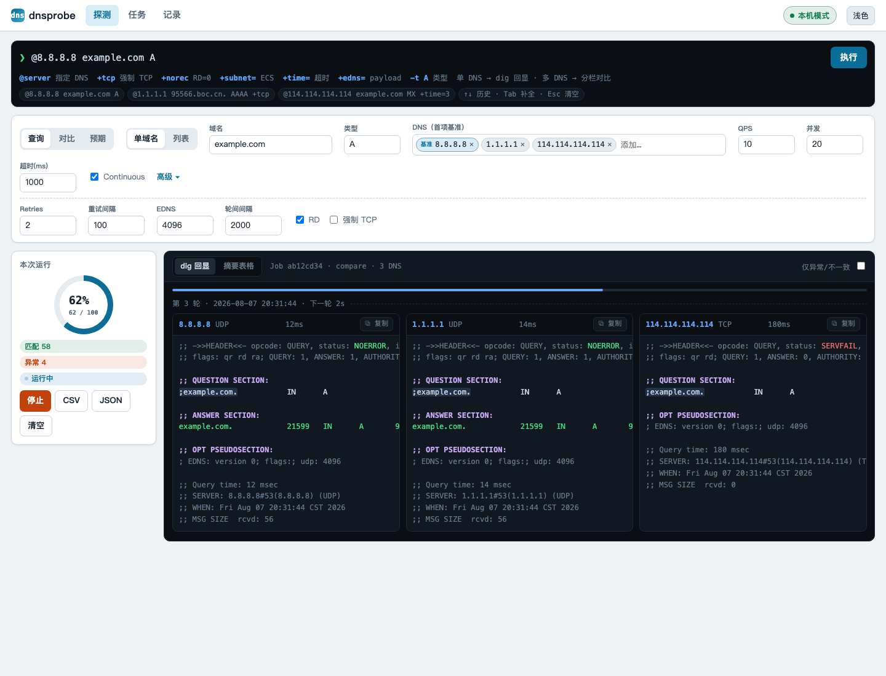
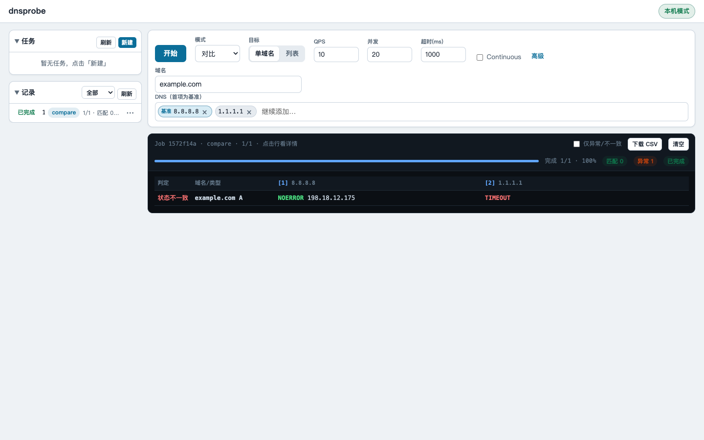

# dnsprobe 发布仓库（二进制 + 使用文档）

> 源码为**私有仓库**，不在此开放；本仓库只提供编译好的可执行文件与使用文档。

## 下载

### 一键安装 / 更新（Linux、macOS、FreeBSD）

默认安装到 `/usr/local/bin/dnsprobe`；重复执行即检查并更新到 latest Release：

```bash
curl -fsSL https://raw.githubusercontent.com/cnzhanglu/dnsprobe-dist/main/install.sh | sudo bash
```

自定义安装位置（无需 root）：

```bash
curl -fsSL https://raw.githubusercontent.com/cnzhanglu/dnsprobe-dist/main/install.sh | \
  DNSPROBE_INSTALL_BIN="$HOME/.local/bin/dnsprobe" bash
```

systemd 服务更新时可同时重启并在失败时回滚：

```bash
sudo DNSPROBE_INSTALL_BIN=/opt/dnsprobe/dnsprobe DNSPROBE_SERVICE=dnsprobe ./install.sh
```

脚本会先读取 Release 的 `SHA256SUMS`；本机已是最新版时不会重复下载二进制。新文件通过校验且可执行后才替换旧文件。

### 手动下载

到 [Releases](https://github.com/cnzhanglu/dnsprobe-dist/releases) 选择对应平台：

| 平台 | 文件 |
|------|------|
| macOS (Apple Silicon) | `dnsprobe-darwin-arm64` |
| macOS (Intel) | `dnsprobe-darwin-amd64` |
| Linux x86_64 | `dnsprobe-linux-amd64` |
| Linux ARM64 | `dnsprobe-linux-arm64` |
| Linux 386 | `dnsprobe-linux-386` |
| Windows x64 | `dnsprobe-windows-amd64.exe` |
| Windows ARM64 | `dnsprobe-windows-arm64.exe` |
| FreeBSD x86_64 | `dnsprobe-freebsd-amd64` |

每个 Release 附 `SHA256SUMS`，下载后用以下命令校验：

```bash
# macOS
shasum -a 256 -c SHA256SUMS
# Linux / Windows(可配合 git-bash 或 PowerShell Get-FileHash)
sha256sum -c SHA256SUMS
```

## 界面预览

**TUI 拨测演示**（终端界面动图）

| 场景 | 演示 |
|------|------|
| 启动 |  |
| 查询 |  |
| 对比 |  |

**Web 界面预览**

| 深色模式 | 浅色模式 |
|------|------|
|  |  |

## 使用文档

- [使用说明（拨测列表格式 / CLI / TUI / Web）](USAGE.md)
- [CLI 命令参考](CLI_COMMANDS.md)
- [TUI 命令参考](TUI_COMMANDS.md)
- [TUI 输出控制](TUI_OUTPUT_CONTROL.md)
- [Web API](docs/api.md)

> 文档随每次 Release 自动同步更新；使用中如有问题，请联系维护者（源码仓库为私有）。
